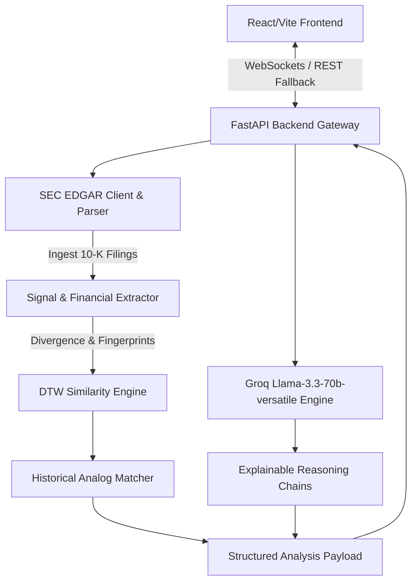

# ForeTrace

<div align="center">

**A Structural Intelligence Platform for Corporate Analysis**

<p align="center">
  ForeTrace pulls SEC EDGAR corporate filings (Forms 10-K/10-Q), extracts complex financial and operational signals, and leverages large language models to construct transparent, explainable evaluations of corporate health, market positioning, and historical analogies.
</p>

*This is not a stock prediction tool, trading bot, or flashy momentum dashboard. It is a calm, explainable intelligence workspace built for investors and analysts who read the filings.*

</div>

---

##  The Core Question

> **"What kind of company is this becoming — how structurally healthy is it, what market forces shape it, what historical situations resemble it, and what risks and opportunities emerge from that?"**

Most modern financial tools focus on **what happened** (backwards-looking data) or attempt to guess **what will happen** (predictions). ForeTrace focuses on **structural configuration**: finding historically similar situations, explaining why they mattered, and outlining the paths they followed.

---

##  Workspace Previews

<details>
<summary> Click to view platform screenshots</summary>

### 1. Homepage & Explorer
*A calm, research-oriented starting point featuring featured companies and quick-access profiles.*


### 2. Market Structure Feed
*Real-time signal tracking highlighting structural shifts detected in the corporate ecosystem.*


### 3. Analog Engine
*Identifies historically similar companies and trajectories using trend fingerprinting—not vibes.*


### 4. Reasoning Engine
*No black-box assertions. Every evaluation displays a complete chain of evidence and confidence scores.*


</details>

---

##  Architecture

ForeTrace employs a decoupled architecture where parsing, analysis, and visualization are separated.



### Modular Responsibility Layers

| Layer | Responsibility |
| :--- | :--- |
| **Market Data Infrastructure** | Automated ingestion of Form 10-K/10-Q filings, normalization, and caching. |
| **Structural Intelligence Engine** | Divergence detection, balance sheet stress indicators, and regime classification. |
| **Historical Analog Engine** | Dynamic Time Warping (DTW) similarity matching on corporate operational trends. |
| **Sentiment Intelligence** | finBERT analysis of Management Discussion & Analysis (MD&A) narrative shifts. |
| **Explainable Reasoning** | groq-assisted LLM summarization, confidence estimation, and evidence mapping. |
| **Security & Isolation** | Strict CORS matching, rate-limiting, and credentials isolation. |

---

##  Features

- **Live Streaming Analysis Workspace:** streams real-time parsing and analysis phases using **WebSockets** with an automatic **HTTP REST fallback** mechanism.
- **Trie-Based Instant Search:** client-side auto-complete search bar powered by an in-memory **Trie data structure** indexing tickers and names.
- **Side-by-Side Comparator:** allows analysts to evaluate structural metrics, risk profiles, and historical momentum between two companies simultaneously.
- **Universal Command Palette (`Cmd + K`):** keyboard-friendly navigation hub to traverse pages, search entities, and toggle theme contexts instantly.
- **Clean Premium Design:** a custom theme system built entirely on CSS design variables, featuring glassmorphism, responsive breakpoint hooks (`useWindowWidth`), and custom SVG visualizers.

---

##  Getting Started

### Prerequisites
- Python 3.9 or higher
- Node.js v18 or higher
- npm or yarn

### 1. Clone the Repository
```bash
git clone https://github.com/Learner2006/foretrace.git
cd foretrace
```

### 2. Backend Setup
1. Navigate to the backend directory and set up a virtual environment:
   ```bash
   cd backend
   python3 -m venv venv
   source venv/bin/activate  # On Windows use `venv\Scripts\activate`
   ```
2. Install Python dependencies:
   ```bash
   pip install -r requirements.txt
   ```
3. Configure environment variables in a `.env` file under `backend/`:
   ```env
   GROQ_API_KEY=your_groq_api_key_here
   ```
4. Start the FastAPI server:
   ```bash
   uvicorn main:app --reload
   ```

### 3. Frontend Setup
1. Navigate to the frontend directory:
   ```bash
   cd ../frontend
   ```
2. Install npm dependencies:
   ```bash
   npm install
   ```
3. Start the Vite development server:
   ```bash
   npm run dev
   ```
4. Build the optimized production bundle:
   ```bash
   npm run build
   ```

---

##  Security & Isolation

- **CORS Configuration:** strict origin matching on backend routes.
- **Rate Limiting:** integrated slowapi limits on core analysis endpoints.
- **Isolated Secrets:** no environment variables or API keys are committed or exposed client-side.
- **Leftover Exclusions:** `.gitignore` blocks deployment configurations, build folders (`dist/`), and node modules.

---

##  Platform Constraints

To maintain empirical integrity, ForeTrace will **never**:
1. **Emit buy/sell recommendations:** we supply evidence and historical analogies; the interpretation is up to the analyst.
2. **Present black-box conclusions:** every AI summary or classification must map to source SEC text/data.
3. **Make absolute predictions:** we model trajectories and similarity indices rather than speculatively projecting numbers.