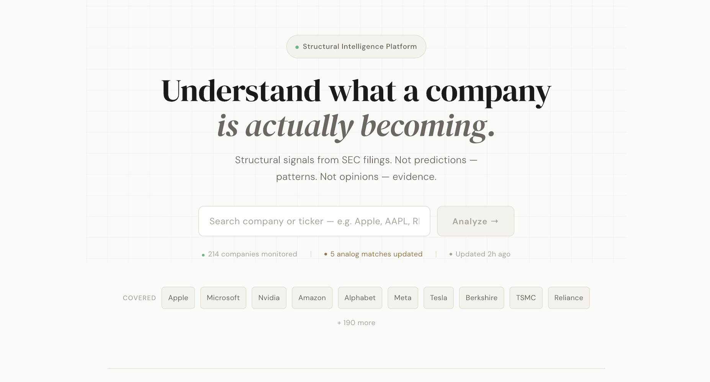
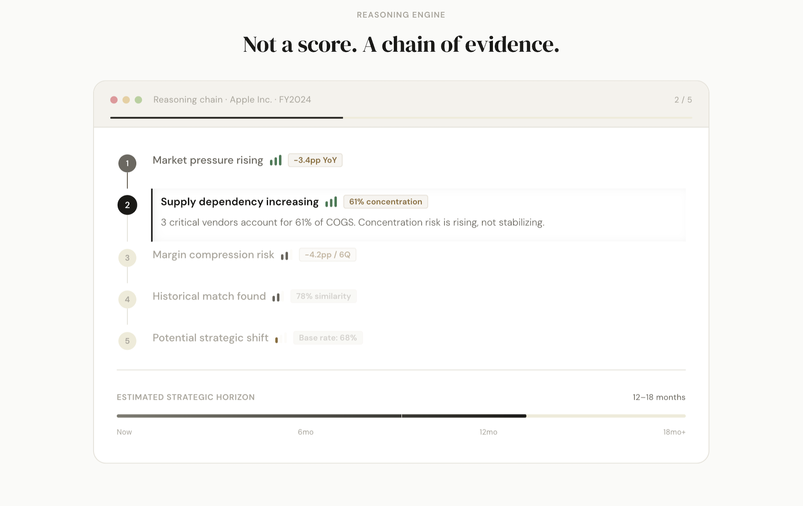
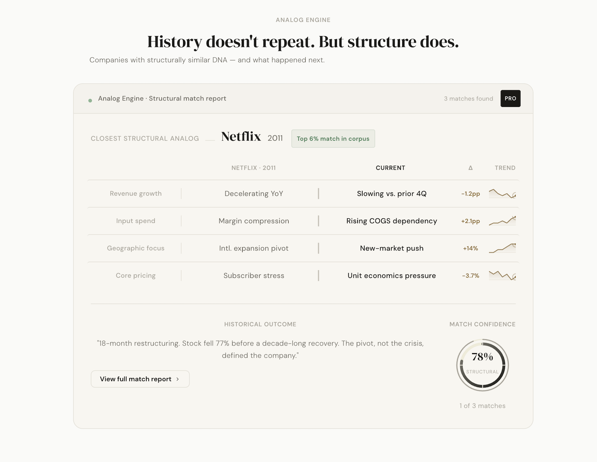
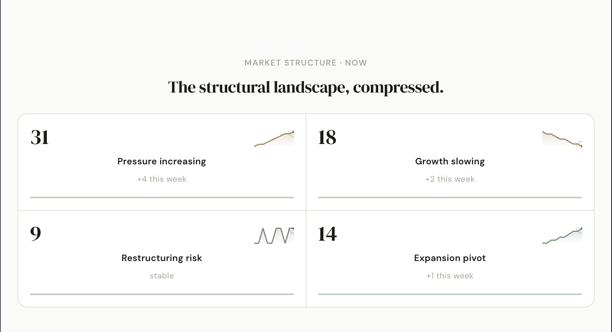

<div align="center">
  <h1>ForeTrace</h1>
  <p><strong>Forensic structural analysis of public companies.</strong></p>
</div>

> **Engineering Note:** For frictionless technical review, this build keeps focus entirely on the AI reasoning pipeline — SEC filing → structural analysis → historical analogs. User authentication and database persistence are deliberately out of scope. Compare and Pro-tier UI demonstrate the intended production shape but are stateless by design.



---

## The Thesis

ForeTrace is **not** a stock predicting tool. The internet is already full of excellent tools designed to forecast short-term price movements and analyze market momentum.

Instead, ForeTrace is a deep **structural company analyzer**. It ignores stock prices and focuses entirely on business integrity. It assumes baseline competence and acts as a skeptical forensic strategist to uncover eroding moats, dangerous strategic pivots, and historical analogies buried deep within SEC 10-K filings.

---

##  Key Features

- **Structural Extraction:** Strips away management fluff to identify the true behavioral pattern of a business.
- **The Analog Engine:** Matches current trajectories against historical successes and failures (e.g., "Structurally resembles BlackBerry in 2008").
- **Head-to-Head Compare:** Forces two companies into a structural battle to map diverging moats.
- **Dynamic AI Routing:** Fault-tolerant orchestration cascading through Llama 3.3, Llama 3.1, and DeepSeek based on API availability.

---

##  Screenshots

### Reasoning Engine


### The Analog Engine


### Market Structure


---

##  How It Works

1. **Ingestion:** Fetches the latest 10-K from SEC EDGAR.
2. **Parallel Analysis:** 5 Level-1 engines analyze the text concurrently.
3. **Synthesis:** Level-2 engines (Analog & Recommendation) synthesize the L1 outputs.
4. **Delivery:** The Composer Engine aggregates the JSON results into a unified frontend report.

---

##  Architecture Diagram

```text
SEC 10-K Filing Data
        │
        ▼
   Composer Engine (Orchestrator)
        │
        ├────────────┬────────────┬────────────┬────────────┐
        ▼            ▼            ▼            ▼            ▼
   Financial      Business      Market       Risk      Relationship
   Engine         Engine        Engine       Engine    Engine
        │            │            │            │            │
        └────────────┴──────┬─────┴────────────┴────────────┘
                            ▼
        ┌───────────────────┴───────────────────┐
        ▼                                       ▼
  Analog Engine                        Recommendation Engine
```

---

##  Why Multiple AI Engines?

If you ask a single LLM to analyze financials, execution risk, and analogies all at once, it hallucinates and loses context. 

We deployed **7 specialized AI engines**. Each has a single, highly-focused responsibility. They run in parallel via `asyncio.gather`, drastically reducing latency while eliminating context-bloat hallucinations.

---

##  Tech Stack

- **Frontend:** React, Vite, Framer Motion, Vanilla CSS.
- **Backend:** Python, FastAPI, asyncio.
- **AI Infrastructure:** Groq API (Ultra-low latency inference).
- **Data Source:** SEC EDGAR (`sec-api`).

---

##  Project Structure

```text
/foretrace
├── /frontend           # React/Vite App 
│   ├── /src/pages      # Narrative-driven UI Views
│   └── /src/components # Reusable UI Primitives
└── /backend            # FastAPI App 
    ├── /app/engines    # The 7 AI Reasoning Engines
    └── /app/clients    # API Clients (Groq, SEC)
```

---

##  Local Development Setup

### 1. Environment Variables
Create `/backend/.env`:
```bash
GROQ_API_KEY="your_groq_key"
```

### 2. Backend Setup
```bash
cd backend
python -m venv .venv
source .venv/bin/activate
pip install -r requirements.txt
uvicorn app.main:app --reload
```

### 3. Frontend Setup
```bash
cd frontend
npm install
npm run dev
```

---

##  Roadmap

- [x] Multi-engine concurrent architecture
- [x] Dynamic model routing and auto-fallback
- [x] Narrative-driven frontend UI
- [ ] Redis caching for parsed SEC filings
- [ ] Earnings call transcript ingestion
- [ ] Custom Analyst Personas (Value, Short Seller, etc.)

---

##  Current Limitations

- **Limited Company Universe:** The AI currently only analyzes a curated list of top-tier companies (S&P 500 equivalent) rather than the entire global stock market.
- **Cold Start Latency:** Heavy head-to-head comparisons require triggering 10 concurrent AI models across two SEC filings. This can take 20-30 seconds on un-cached requests.
- **Public Beta (No Auth):** ForeTrace is currently deployed as an open-access system without user accounts or persistent portfolio tracking.

---

## License
© All Rights Reserved
