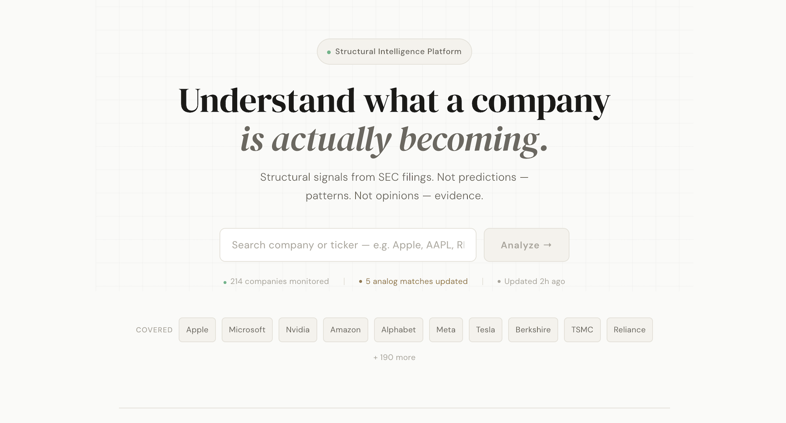
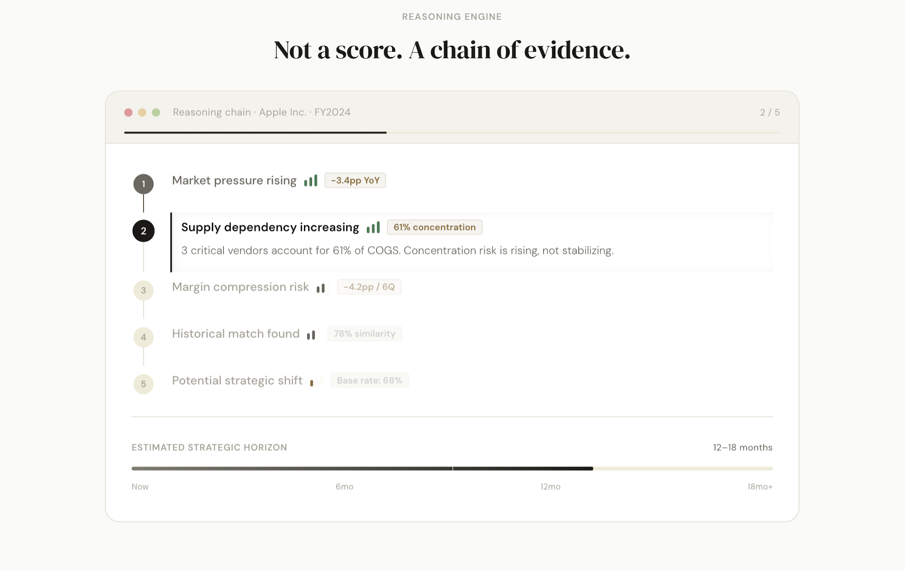
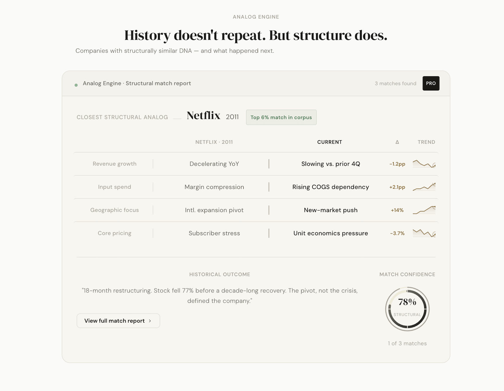
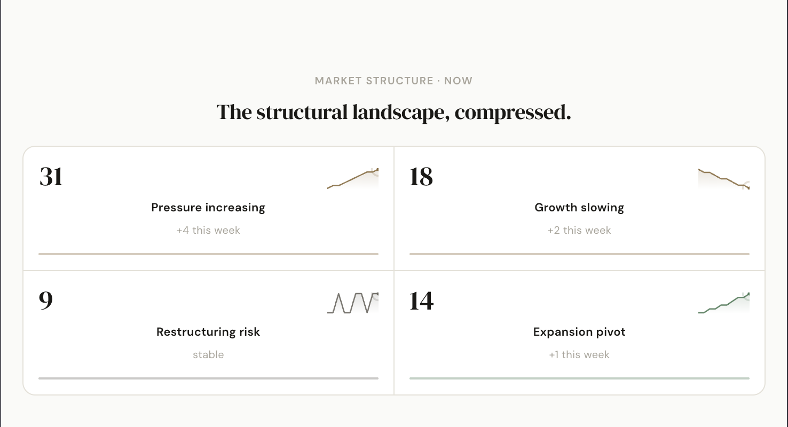

<div align="center">
  <h1>ForeTrace</h1>
  <p><strong>Forensic structural analysis of public companies.</strong></p>
  <p><a href="https://foretrace.vercel.app" target="_blank">🌐 Live Demo</a></p>
</div>

> **Engineering Note:** For frictionless technical review, this build keeps focus entirely on the AI reasoning pipeline — SEC filing → structural analysis → historical analogs. User authentication and database persistence are deliberately out of scope. The Pro-tier UI demonstrates the intended production shape but is stateless by design.



---

## The Thesis

ForeTrace is **not** a stock predicting tool. The internet is already full of excellent tools designed to forecast short-term price movements and analyze market momentum.

Instead, ForeTrace is a deep **structural company analyzer**. It ignores stock prices and focuses entirely on business integrity. It assumes baseline competence and acts as a skeptical forensic strategist to uncover eroding moats, dangerous strategic pivots, and historical analogies buried deep within SEC 10-K filings.

---

##  Key Features

- **Structural Extraction:** Strips away management fluff to identify the true behavioral pattern of a business.
- **The Analog Engine:** Matches current trajectories against historical successes and failures (e.g., "Structurally resembles BlackBerry in 2008").

- **Dynamic AI Routing:** Fault-tolerant orchestration cascading through Llama 3.3, Llama 3.1, and DeepSeek based on API availability.

---

##  Screenshots

### Reasoning Engine


### The Analog Engine


### Market Structure


---

##  How It Works

1. **Ingestion:** Fetches the latest 10-K from SEC EDGAR.
2. **Extraction:** A single-pass Extraction Engine distills the text into a strict Corporate Knowledge Graph.
3. **Deterministic Mapping:** 5 pure Python engines parse the Knowledge Graph into structural signals instantly.
4. **Synthesis:** A Strategic Synthesis Engine generates historical analogs and mitigation levers.
5. **Delivery:** The Composer Engine aggregates the JSON results into a unified frontend report.

---

##  Architecture Diagram

```text
SEC 10-K Filing Data
        │
        ▼
   Unified Extraction Engine (LLM)
        │
        ▼
  Corporate Knowledge Graph
        │
        ├────────────┬────────────┬────────────┬────────────┐
        ▼            ▼            ▼            ▼            ▼
   Financial      Business      Market       Risk      Relationship
   (Python)       (Python)      (Python)     (Python)  (Python)
        │            │            │            │            │
        └────────────┴──────┬─────┴────────────┴────────────┘
                            ▼
                Strategic Synthesis Engine (LLM)
```

---

##  The Unified Extraction Architecture

Originally, ForeTrace utilized 5 concurrent LLM calls to analyze different dimensions of a company. However, this repeatedly triggered `429 Rate Limit` errors and consumed excessive tokens.

We completely redesigned the pipeline around a **Corporate Knowledge Graph**. Now, a single hyper-optimized L1 Extraction Engine reads the SEC filing once and extracts the core structural pillars. Then, 5 pure Python deterministic engines format these pillars instantly. Finally, a single L2 Synthesis Engine generates analogs. 

This architecture **reduced token consumption by 80%** while preserving the exact same high-quality analysis.

---

##  Tech Stack

- **Frontend:** React, Vite, Framer Motion, Vanilla CSS.
- **Backend:** Python, FastAPI, asyncio.
- **AI Infrastructure:** Groq API (Ultra-low latency inference).
- **Data Source:** SEC EDGAR (`sec-api`).

---

##  Project Structure

```text
/foretrace
├── /frontend           # React/Vite App 
│   ├── /src/pages      # Narrative-driven UI Views
│   └── /src/components # Reusable UI Primitives
└── /backend            # FastAPI App 
    ├── /app/engines    # The 7 AI Reasoning Engines
    └── /app/clients    # API Clients (Groq, SEC)
```

---

##  Local Development Setup

### 1. Environment Variables
Create `/backend/.env`:
```bash
GROQ_API_KEY="your_groq_key"
```

### 2. Backend Setup
```bash
cd backend
python -m venv .venv
source .venv/bin/activate
pip install -r requirements.txt
uvicorn app.main:app --reload
```

### 3. Frontend Setup
```bash
cd frontend
npm install
npm run dev
```

---

##  Roadmap

- [x] Multi-engine concurrent architecture
- [x] Dynamic model routing and auto-fallback
- [x] Narrative-driven frontend UI
- [ ] Redis caching for parsed SEC filings
- [ ] Earnings call transcript ingestion
- [ ] Custom Analyst Personas (Value, Short Seller, etc.)

---

##  Production Deployment

### 1. Render Blueprint Deployment
ForeTrace uses a Render Blueprint (`render.yaml`) to define its entire infrastructure stack automatically. 
To deploy to Render:
1. Push this repository to your GitHub account.
2. Go to the Render Dashboard, click **New**, and choose **Blueprint**.
3. Link your repository. Render will automatically configure:
   - A secure backend Docker Web Service (Free Tier).
   - A React static frontend build (Free Tier).
4. Go to the Render Dashboard under **foretrace-backend** and set your actual `GROQ_API_KEY` environment secret.

### 2. Manual Docker Build
If deploying to a custom host or cloud provider, build the backend production container:
```bash
cd backend
docker build -t foretrace-backend .
docker run -p 8000:8000 \
  -e ENV=prod \
  -e GROQ_API_KEY="gsk_..." \
  -e API_KEY="a_secure_token" \
  -e ADMIN_API_KEY="another_secure_token" \
  foretrace-backend
```

### 3. Required Environment Variables
Ensure the following variables are configured in production:
* `ENV`: Set to `prod` (activates production validators).
* `GROQ_API_KEY`: Groq Cloud developer key.
* `API_KEY`: Secure secret token for REST routes (sent via `X-API-Key` header).
* `ADMIN_API_KEY`: Administrative token for cache stats and invalidation endpoints (`X-Admin-Key` header).
* `SENTRY_DSN` *(Optional)*: Error logging capture URL.

### 4. Monitoring & Observability
* **Prometheus Metrics:** Served on the `/metrics` endpoint (integrated via `prometheus-fastapi-instrumentator`).
* **Sentry Errors:** Automated exception reporting is enabled if `SENTRY_DSN` is configured.
* **Liveness Probe:** GET `/live` returns `{"status": "alive"}`.
* **Readiness Probe:** GET `/ready` checks if Groq and SEC circuit breakers are healthy.

### 5. Troubleshooting
* **Error 401 Unauthorized:** Verify that the frontend static build environment variable `VITE_API_TOKEN` matches the backend's production `API_KEY` exactly.
* **Service Degraded (503):** If `/ready` returns 503, the external API circuit breakers are active. Check Groq rate limits or SEC service availability.

---

##  Current Limitations

- **Limited Company Universe:** The AI currently only analyzes a curated list of top-tier companies (S&P 500 equivalent) rather than the entire global stock market.
- **Cold Start Latency:** Analyzing a complex company requires multiple LLM passes across a massive SEC filing context window. This can take several seconds on un-cached requests.
- **Public Beta (No Auth):** ForeTrace is currently deployed as an open-access system without user accounts or persistent portfolio tracking.

---

## License

This project is licensed under the [MIT License](LICENSE).
